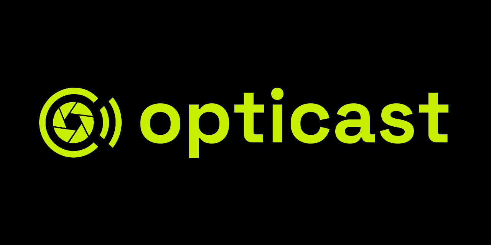
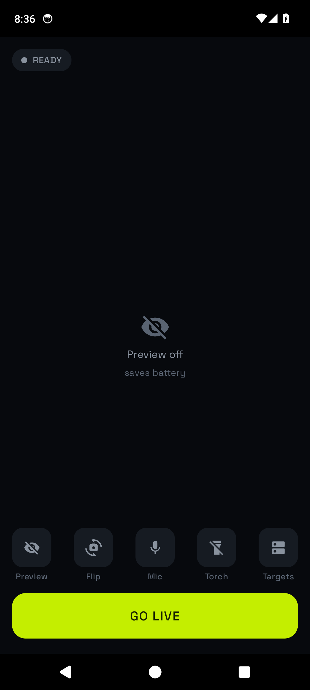
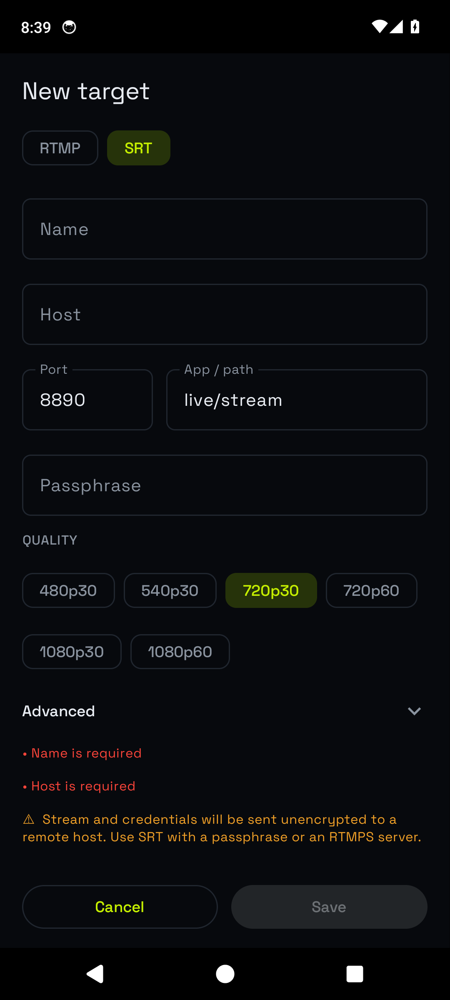

# Opticast

<p align="center">
  
</p>

Opticast is an Android application that captures the device camera and microphone and encodes them to a live video stream over **RTMP** or **SRT**. You point it at a server you control and it publishes there; the destination URL is the only thing that leaves the device.

It is built on [RootEncoder](https://github.com/pedroSG94/RootEncoder) for capture and muxing, with a Jetpack Compose UI. Minimum Android 8.0 (API 26).

## What it does

- **Output protocols:** RTMP/RTMPS and SRT.
- **Video:** H.264 or H.265, hardware-encoded. Resolution, frame rate and bitrate are configurable.
- **Audio:** AAC from the device microphone, with a mute toggle.
- **Connection profiles:** save any number of targets. Each stores its protocol, host, port, stream path/key, optional SRT passphrase, and its own quality settings.
- **Quality:** presets from 480p30 up to 1080p60, or an **Advanced** mode for an explicit resolution / fps / bitrate / codec. The editor flags unusual or unencrypted configurations as warnings but does not block them.
- **Adaptive bitrate:** the encoder drops bitrate when the link is congested and recovers when it clears.
- **Reconnect:** automatic reconnection with capped exponential backoff on connection loss.
- **Foreground service:** streaming runs in a typed foreground service with a wake lock, so it continues with the screen off or the app backgrounded. Start/stop is exposed in the notification.
- **Camera controls:** front/back switch, tap-to-focus, pinch-to-zoom, torch.
- **Optional preview:** the on-screen camera preview is off by default to reduce CPU and battery cost; the stream runs regardless.
- **Credential storage:** stream keys and passphrases are stored with Android Keystore-backed encryption.
- **No network access beyond the configured server.** No analytics, ads, or telemetry.

## Screenshots

<p align="center">
  
  &nbsp;&nbsp;
  
</p>

## Usage

1. Run an RTMP/SRT server you control — for example [MediaMTX](https://github.com/bluenviron/mediamtx) — or use any compatible ingest endpoint.
2. **Targets → New:** choose RTMP or SRT, enter host, port and path (and a passphrase/key if the server requires one), then pick a quality preset or open **Advanced**. Tap the profile to select it.
3. **Go Live.** The status chip reports connection state, live bitrate and uptime. Pull the same path in OBS, VLC, or any compatible player.
4. While live: toggle the preview, flip the camera, mute, or switch on the torch. Stop from the on-screen button or the notification.

## Install

- **APK:** download from [Releases](https://github.com/teop23/opticast/releases) and sideload.
- **Updates:** add `https://github.com/teop23/opticast` to [Obtainium](https://github.com/ImranR98/Obtainium) to track releases.

## Building

```bash
./gradlew testDebugUnitTest   # unit tests
./gradlew assembleDebug       # debug APK
./gradlew installDebug        # install to a connected device
./gradlew assembleRelease     # release build (signed if keystore.properties is present)
```

Toolchain: AGP 8.11.1, Gradle 8.13, Kotlin 2.3.21, compileSdk 36, JDK 17+.

Release signing reads `keystore.properties` from the repo root (git-ignored), with keys `storeFile`, `storePassword`, `keyAlias`, `keyPassword`. Without that file `assembleRelease` still produces an unsigned APK.

## Privacy

Opticast collects nothing. See [PRIVACY.md](PRIVACY.md).

## License

[GPL-3.0](LICENSE). RootEncoder is Apache-2.0.

## Roadmap

Possible future work, not yet implemented:

- Multiple simultaneous destinations.
- Local recording alongside the live stream.
- RTSP server output (pull instead of push).
- WebRTC / WHIP publishing for low-latency delivery.
